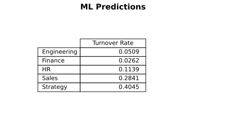

# Executive Summary
### TLDR:
**Summary**
- We expect overall employee churn to be between 15 - 20% with 80% level of accuracy for FY 2025
  - Churn rates vary across job functions, highest rates for Ops & lowest for Engineering/Finance
  - Largest drivers for churn is employee Tenure & working from either the Seattle or SanFran branches
    - On average, 1 additional year of tenure is associated with a 5% decrease in churn
      - Highest rates of churn for associates < 2 years tenure
    - Seattle & SanFran branches are associated with 5% less churn
      
**Recommendation**
- Investigating the differences between Seattle/SanFran & the NYC location, as both have similar work forces but different churn rates
- Paying extra attention to associates with < 2 years of tenure & identify what is driving attrition
 
### Hypothesis
&nbsp;&nbsp;&nbsp;&nbsp;*We anticipate **pay rate, job function, location, tenure & total promotions** are correlated with employee turnover*
  
&nbsp;&nbsp;&nbsp;&nbsp;*Using these key indicators we will construct an quarterly churn rate for 2025 to ensure consistent staffing*

### Data
*Assumptions*
- Total promotions only include what can be observed in the data (associate may have received a promotion prior to 2022)
- We assume any job changes in data imply a promotion

*Description*
Given Values
- Quarterly associate level data from Jan 2022 to Oct 2024
  - Gegraphical (location)
  - Job Type Characteristics (function, level, pay type)

Calculated Values
- Total tenure & role tenure for associates

### Methods
We use a dual approach to estimate churn in 2025 - analytical & ML. 

First is an analytical approach where (only includes historical churn rates for a given job type). The second approach uses an ML model that utlizes all of our employee data (not only historical churn rates)

*Analytical*
-  We visually inspect the data & apply a standard time series model. Put simply, this is an elevated moving average
  -  Pros: simple to implement & easy to explain
  -  Cons: unlikely to catch new trends & difficult to improve since it is only looking at past churn rates

*ML*
- We utilize all of our employee data & apply an ML model to predict if our active associates are likely to leave the company
  - Pros: utilizes all of the information at our disposal, more likely to catch new patterns in data, typically more accurate
  - Cons: somewhat blackbox, difficult derive insights from
### Results
- For FY 2025 our models predict 15% (time series) to 26% (ML), with wide variation across job type
- Churn rates show similar results with both models (within 5%) except for  Sales & StrategyOps
  - Largest variation is in Sales & StrategyOps which is to be expected with the spikey data shape (Sales) & inconsistent trend (Strategy) making it difficult to fit a time series model (see **appendix**)

**Model Predictions**

  
  

**Attrition Drivers**
- The ML model indicates the highest driver of churn is employee Tenure & working in the SanFran/Seattle offices
  - each additional year of Tenure is associated with a 5% decrease in attrition, with a steep dropoffs at year 3 & 4
  - Working from SanFran/Seattel is also associated with a 5% decrease in attrition

  
  

### Recommendation
- 
- It is important to note that churn only captures net staff levels, not how many associates ***
- Biggest opportunities

## Appendix

### Supplemental Notes
*Trends*
- Hourly Staff have highest rates of churn
  - Hourly staff is also highly collinear with OpsStrategy & the MoonMar1 location
  - OpsStrategy has the highest rate of churn & is a near constant pattern arounnd 27% per quarter
- Sales has the next highest rate of church and it is highly seasonal, averaging 22% per quarter
  - avg tenure?
- HR had a constant churn rate in early 2022, high variability in 2023, then stabalizing in 2024
  - was churn due to voluntary resignations, layoffs, or a combination? This will help determine the best forecast for 2025
- Both engineering & finance have the lowest churn rates and follow a nearly identical seasonality
  -  avg tenure?
  -  why?

*Models - Exponential Smoothing*
- We use an exponential smoothing model with additive seasonality & trend, this model fits well for Engineering & Sales, but has large misses in the other job types
  - If we proceed with this method, it is recommended to
    - switch OpsStrategy to a moving average since it is fairly stable quarter over quarter
    - investigate why the model overshot for Finance but not Engineering. As both jobs have fairly similar patterns it may be worth combining them
- To measure accuracy, we use first 8 periods in the data to build the model & test on the remaining 4 periods
- We calculate a weighted MAPE, weighting by a job function (to account for differences in workforce sizes)

 

  
  

*Models - ML*
- We use XGBOOST Classifier (logistic random forest) to predict if a given associate is likely to leave the company in the next quarter
- We separate our testing/training data the same as Model 1 (Exp. Smooth)
- After our predictions, we map back when the model anticipates the associate to leave & measure the accuracy
- 
### Code

